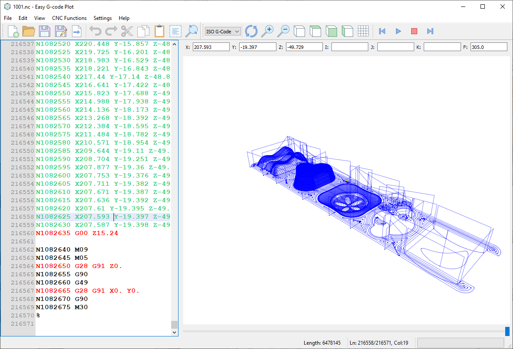

# Easy G-Code Plotter

<!-- markdownlint-disable MD033 -->
<details>
  <summary><h2>Screenshot</h2></summary>

<p align="center">
  <div style="text-align: center;">
    
    <p>Image 1</p>
  </div>
</p>

</details>

---

- [Easy G-Code Plotter](#easy-g-code-plotter)
  - [Overview](#overview)
  - [Features](#features)
    - [📁 File Management](#-file-management)
    - [✍️ Code Editor](#️-code-editor)
    - [📊 Visualization](#-visualization)
    - [🔧 Code Manipulation](#-code-manipulation)
    - [📤 Export Options](#-export-options)
    - [📈 Analysis Tools](#-analysis-tools)
  - [Installation](#installation)
    - [Prerequisites](#prerequisites)
    - [Installation Steps](#installation-steps)
  - [Usage](#usage)
    - [Basic Workflow](#basic-workflow)
    - [Key Interface Elements](#key-interface-elements)
      - [1. Editor Panel](#1-editor-panel)
      - [2. 3D Plot Panel](#2-3d-plot-panel)
      - [3. Control Panel](#3-control-panel)
      - [4. Status Bar](#4-status-bar)
    - [Export Configuration](#export-configuration)
  - [Supported G-code Commands](#supported-g-code-commands)
    - [Motion Commands](#motion-commands)
    - [Plane Selection](#plane-selection)
    - [Coordinate Systems](#coordinate-systems)
    - [Canned Cycles](#canned-cycles)
    - [Tool Compensation](#tool-compensation)
    - [Miscellaneous](#miscellaneous)
  - [Configuration](#configuration)
    - [Settings File](#settings-file)
      - [Plot Settings](#plot-settings)
      - [Editor Settings](#editor-settings)
      - [Export Settings](#export-settings)
      - [Geometry Settings](#geometry-settings)
  - [Troubleshooting](#troubleshooting)
    - [Common Issues](#common-issues)
    - [Logging](#logging)
  - [Technical Details](#technical-details)
    - [Architecture](#architecture)
    - [Performance](#performance)
    - [File Support](#file-support)
  - [Development](#development)
    - [Building from Source](#building-from-source)
    - [Code Structure](#code-structure)
    - [Adding Features](#adding-features)
  - [License](#license)

---

## Overview

Easy G-Code Plotter is a comprehensive desktop application for viewing, editing, and analyzing G-code files. It provides a rich set of features including 3D visualization, code editing with syntax highlighting, export functionality with multiple output formats, and various code manipulation tools.

## Features

### 📁 File Management

- **New/Open/Save**: Create, open, and save G-code files
- **Drag & Drop**: Open files by dragging them onto the application
- **Recent Files**: Track recently opened files
- **Auto-save Prompt**: Warns about unsaved changes before closing

### ✍️ Code Editor

- **Syntax Highlighting**: Color-coded G-code commands (rapid moves, linear moves, circular moves)
- **Customizable Editor**:
  - Adjustable font family, size, and style
  - Configurable margins and line numbers
  - Caret line highlighting
  - Whitespace visibility control
- **Advanced Editing**:
  - Find and Replace with options (case-sensitive, whole word, wrap-around)
  - Undo/Redo operations
  - Copy/Cut/Paste functionality
  - Line numbering with customizable spacing

### 📊 Visualization

- **3D Plotting**: Real-time visualization of toolpaths
- **Multiple Views**: 3D, Top, Front, and Left view modes
- **Zoom Controls**: In/out zoom functionality
- **Grid Display**: Configurable grid with adjustable size and spacing
- **Lathe Mode**: Specialized view for lathe operations
- **Toolpath Animation**: Step-by-step simulation with playback controls

### 🔧 Code Manipulation

- **Renumber Blocks**: Add, remove, or renumber N-line sequences
- **Cleanup Tools**:
  - Remove unnecessary spaces
  - Delete empty lines
  - Eliminate comments
- **Block Skipping**: Skip commented lines with leading "/"

### 📤 Export Options

- **Multiple Output Languages**: Support for different G-code dialects
- **Export Modes**:
  - Absolute or incremental positioning
  - Force address output
  - Leading zero suppression
- **Program Headers/Footers**: Customizable start and end program blocks
- **Safety Lines**: Option to add standard safety commands
- **Delimiter Control**: Space or no-space between commands

### 📈 Analysis Tools

- **Statistics**: Calculate toolpath length and machining time
- **Coordinate Limits**: Determine min/max X, Y, Z values
- **Feed Rate Analysis**: Identify rapid vs. feed moves

## Installation

### Prerequisites

- Python 3.7+
- PyQt5
- PyQtGraph
- QScintilla2
- NumPy

### Installation Steps

1. Clone the repository:

   ```bash
   git clone <repository-url>
   cd easy-gcode-plotter
   ```

2. Install required packages:

   ```bash
   pip install PyQt5 pyqtgraph QScintilla numpy
   ```

3. Run the application:

   ```bash
   python main.py
   ```

## Usage

### Basic Workflow

1. Open a G-code file using **File → Open** or by dragging and dropping it.
2. Select **ISO G-code** for syntax highlighting, then press **Refresh** to apply.
3. View the toolpath in the **3D plot window**.
4. Edit the code in the **syntax-highlighted editor**.
5. Simulate the program using the **playback controls**.
6. Export the modified G-code with the desired settings.

### Key Interface Elements

#### 1. Editor Panel

- Left side of the application
- Syntax-highlighted G-code display
- Line numbers and margin area
- Context menu for editing operations

#### 2. 3D Plot Panel

- Right side of the application
- Interactive 3D visualization
- View control buttons (3D, Top, Front, Left)
- Grid toggle option

#### 3. Control Panel

- **Slider**: Navigate through toolpath steps
- **Coordinate Display**: Current X, Y, Z, I, J, K, Feed values
- **Playback Controls**: Play, stop, forward, backward buttons

#### 4. Status Bar

- Character count
- Cursor position
- Progress bar for long operations

### Export Configuration

Access via File → Export Options:

1. **Language Selection**: Choose G-code dialect
2. **Output Mode**: Absolute/Incremental
3. **Address Forcing**: Always output G/M codes
4. **Program Start/End**: Custom program headers/footers
5. **Sequence Numbers**: Configure N-line numbering
6. **Formatting**: Delimiters and zero suppression

## Supported G-code Commands

### Motion Commands

- `G00`: Rapid positioning
- `G01`: Linear interpolation
- `G02`: Circular interpolation (clockwise)
- `G03`: Circular interpolation (counter-clockwise)

### Plane Selection

- `G17`: XY plane
- `G18`: ZX plane
- `G19`: YZ plane

### Coordinate Systems

- `G54-G59`: Work coordinate systems
- `G90`: Absolute positioning
- `G91`: Incremental positioning

### Canned Cycles

- `G80`: Cancel canned cycle
- `G81`: Drilling cycle
- `G82`: Spot drilling
- `G83`: Peck drilling

### Tool Compensation

- `G40`: Cancel cutter compensation
- `G41`: Cutter compensation left
- `G42`: Cutter compensation right
- `G43`: Tool length compensation positive
- `G49`: Cancel tool length compensation

### Miscellaneous

- `M00`: Program stop
- `M01`: Optional stop
- `M02`: Program end
- `M03`: Spindle clockwise
- `M04`: Spindle counter-clockwise
- `M05`: Spindle stop
- `M06`: Tool change
- `M08`: Coolant on
- `M09`: Coolant off
- `M30`: Program end and reset

## Configuration

### Settings File

The application saves configuration to `config.ini` in the following sections:

#### Plot Settings

- Timer speed
- Arc calculation type
- Machine coordinates
- Lathe mode
- Line/background/grid colors
- Grid size and spacing

#### Editor Settings

- Font family, size, weight, italic
- Caret line color and visibility
- Whitespace and EOL visibility
- Margin settings

#### Export Settings

- Language selection
- Address forcing
- Incremental mode
- Program start/end strings
- Sequence number configuration

#### Geometry Settings

- Window position and size
- Maximized state

## Troubleshooting

### Common Issues

1. **Plot Not Displaying**
   - Ensure the G-code contains valid motion commands
   - Check for syntax errors in the code
   - Verify machine coordinates are set correctly

2. **Export Errors**
   - Confirm output language compatibility
   - Check for invalid characters in custom headers/footers
   - Ensure sufficient disk space

3. **Performance Issues**
   - Reduce plot complexity for very large files
   - Close unnecessary applications
   - Update graphics drivers

### Logging

The application creates a `main.log` file for debugging:

- Log level: DEBUG
- Location: Application directory
- Contains: Conversion errors, export issues, general exceptions

## Technical Details

### Architecture

- **Frontend**: PyQt5 with custom OpenGL visualization
- **Editor**: QScintilla with custom G-code lexer
- **Plotting**: PyQtGraph OpenGL implementation
- **Configuration**: QSettings with INI file storage

### Performance

- Optimized for files up to 10,000 lines
- Incremental plotting for large toolpaths
- Background processing for export operations

### File Support

- **Input**: Standard G-code (.nc, .cnc, .txt)
- **Output**: Customizable G-code formats
- **Encoding**: UTF-8

## Development

### Building from Source

```bash
# Install development dependencies
pip install -r scripts/requirements.txt

# Run tests
python -m pytest tests/

# Create executable (optional)
pyinstaller main.spec
```

### Code Structure

- `main.py`: Main application window
- `main_ui.py`: Qt Designer generated UI
- `find_replace.py`: Find/replace dialog
- `export.py`: Export options dialog
- `block_num.py`: Block numbering dialog
- `files_res.py`: Resource file (icons, etc.)

### Adding Features

1. New G-code commands: Update `convert()` method
2. Visualization enhancements: Modify `addMotion()` method
3. Export formats: Extend `exportPgm()` method

## License

MIT License - See [LICENSE](License.md) for details

---

<p align="center">
  
</p>
