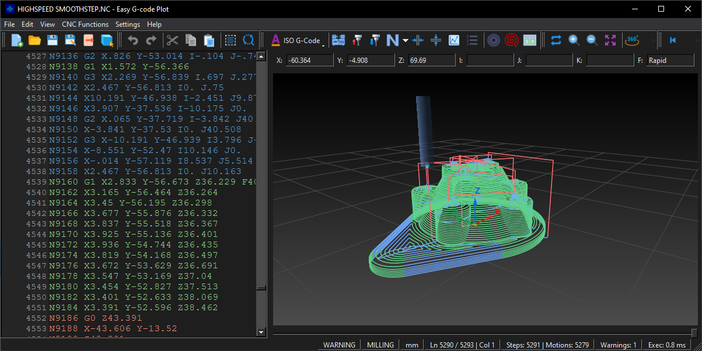
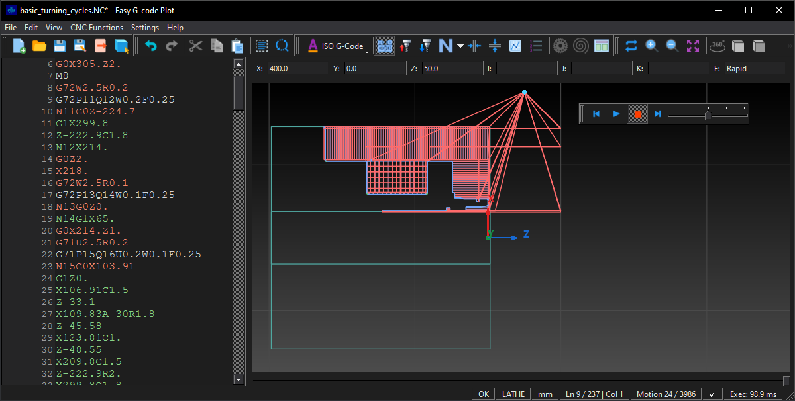
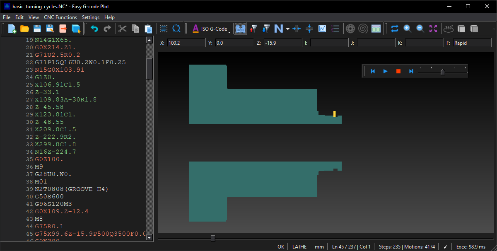

# Easy G-Code Plot

[](https://github.com/MaestroFusion360/easy_gcode_plot/actions/workflows/release.yml)

<!-- markdownlint-disable MD033 -->

<details>
  <summary><h2>Main Window</h2></summary>
  <p align="center">
    
  </p>
</details>

<details>
  <summary><h2>STL Playback</h2></summary>
  <p align="center">
    
  </p>
</details>

<details>
  <summary><h2>Milling</h2></summary>
  <p align="center">
    
  </p>
</details>

<details>
  <summary><h2>Turning</h2></summary>
  <p align="center">
    
  </p>
</details>

<details>
  <summary><h2>Lathe Stock Removal Simulation</h2></summary>
  <p align="center">
    
  </p>
</details>

---

Easy G-Code Plot is a desktop editor, analyzer, simulator and trace exporter for FANUC-style turning and milling programs. Rendering, playback, Stock Removal, statistics, CLI analysis and export consume one resolved trace produced by the shared CNC kernel.

## Highlights

- FANUC turning and milling with Macro B expressions, conditions, loops, `G65` custom-macro calls and `M98/M99` subprograms.
- Turning G70–G76 cycles, G32/G33/G92 threading, tool-nose compensation and direct A/C/corner-R programming.
- Milling canned cycles, helical arcs, `G15/G16` polar-coordinate programming, cutter-radius compensation and G10/G50/G51/G52/G54.1/G68/G69 coordinate operations.
- G-code editor with highlighting, line numbers, search, replace and cleanup tools.
- CNC editing assistants for circular/grid hole patterns, circular/rectangular pockets and reusable persistent snippets.
- Interactive OpenGL toolpath, logical-motion playback and source-line synchronization.
- Toolpath statistics and CIMCO-style UTF-8 Tool List export from the resolved trace and configured tools.
- Cutter-aware turning Stock Removal, including thread profiles.
- ASCII and binary STL overlays with solid and feature-edge modes.
- SQLite-backed turning and milling tool libraries.
- Full Program, Expanded Execution, Plot Data and DXF exports.
- English and Russian UI, Light and Dark themes, UTF-8 and Windows-1251 files.
- Native Cython acceleration with a compatible Python fallback.

Detailed controller behavior, limitations, configuration and troubleshooting are documented in [FAQ.md](FAQ.md), also available through **Help → FAQ**.

## Quick start

### Windows executable

Download the GUI executable and `easy_gcode_plot_cli.exe` from [GitHub Releases](https://github.com/MaestroFusion360/easy_gcode_plot/releases). Python and Visual Studio are not required for the packaged applications.

```powershell
.\easy_gcode_plot_cli.exe --help
.\easy_gcode_plot_cli.exe batch C:\Programs --lang fanuc_mill -o C:\Reports
```

### Linux executables

Download `Easy-G-Code-Plot-<version>-Linux-x64.tar.gz` and its `.sha256` file from [GitHub Releases](https://github.com/MaestroFusion360/easy_gcode_plot/releases). The archive contains separate GUI and CLI executables and preserves their executable permissions. Verify and unpack it with the downloaded version number:

```bash
version=1.6.5
sha256sum -c "Easy-G-Code-Plot-$version-Linux-x64.tar.gz.sha256"
tar -xzf "Easy-G-Code-Plot-$version-Linux-x64.tar.gz"
./easy_gcode_plot
./easy_gcode_plot_cli --help
```

### Run from source

Requirements:

- Python 3.13+
- [uv](https://docs.astral.sh/uv/)
- A C compiler: Visual Studio Build Tools with **Desktop development with C++** on Windows, or a platform compiler and Python development headers on Linux.

```bash
git clone https://github.com/MaestroFusion360/easy_gcode_plot.git
cd easy_gcode_plot
uv sync --no-dev
uv run --no-dev python main.py
```

`uv sync` compiles the tracked Cython `.pyx` sources. Generated `.c`, `.pyd` and `.so` files are not stored in Git. If native extensions cannot be loaded, the application remains functional through the slower Python fallback.

## Basic workflow

1. Open or drag a `.nc`, `.cnc` or `.txt` program into the application.
2. Enable `Lathe Mode` for turning or leave it disabled for milling.
3. Configure WCS, machine home and tools when required.
4. Refresh and inspect the resolved toolpath.
5. Use playback, Tokens/Macro Variables and Statistics to inspect execution. The Macro Variables tab shows the actual Macro B state captured at the current logical playback step.
6. Use **CNC Functions → Hole Calculator**, **Pocket Calculator** or **Snippets** to generate and insert frequently used code at the editor caret.
7. Optionally import an STL reference model.
8. Export the required program or trajectory representation.

## CNC editing assistants

The **CNC Functions** menu and toolbar provide three editor tools:

- **Hole Calculator** inserts coordinates for holes distributed around a circle or over a serpentine rectangular grid and shows a live XY preview.
- **Pocket Calculator** generates a milling fragment for circular or rectangular pockets. It supports clockwise/counterclockwise cutting, multiple Z depths, XY/Z stock, conventional or spiral clearing, helical entry and an optional finish pass along the calculated tool-center contour. Its compact resizable layout includes a live XY preview; rectangular Spiral generates interior clearing before the final contour.
- Hole and Pocket calculators are milling-only assistants: their actions and Insert buttons are disabled in Lathe mode. Because calculation is already reflected by the live preview, the final action is simply **Insert**.
- **Snippets** manages reusable G-code fragments. Snippets can be added, edited, renamed, reordered, deleted and inserted at the current editor caret. They are stored in the per-user SQLite database `snippets.db`; legacy UTF-8 files from the adjacent `snippets` directory are imported once and retained as a backup. Unsaved edits are protected by a Save/Discard/Cancel prompt when selection or dialog state would otherwise replace them, and manual ordering is persisted.

The calculators insert code into the editor; they do not execute or export it automatically. Refresh the toolpath after reviewing the generated block.

Unsupported or ambiguous controller behavior is reported explicitly instead of being converted into guessed geometry.

## Settings

### General

`Settings → Options → General` contains:

- **Language** — English or Russian; applied after restart.
- **Theme** — Light or Dark; custom colors from the **Colors** tab are preserved.
- **Auto Update** and **Auto update max segments** — control non-modal plot refresh while editing. The segment limit applies only to automatic rendering.
- **Maximum generated motions** — limits the total motions produced by one kernel execution and protects against runaway expansion.
- **Toolpanel icons** — selects 32×32, 24×24 or 16×16 toolbar icons; 24×24 is the default.

### Hotkeys

`Settings → Options → Hotkeys` lists commands from the main menus. Select a command and use **Edit shortcut** (or double-click its row) to choose Ctrl, Alt, Shift or Meta and a key. Choose **None** to clear a shortcut; **Restore Defaults** restores the built-in assignments. Conflicting shortcuts are rejected. Refresh defaults to F5; the 3D, Top, Front and Left views default to Ctrl+1, Ctrl+2, Ctrl+3 and Ctrl+4.

### CNC / Execution

`Settings → Options → CNC / Execution` contains:

- **Autodetect Arc Type** — selects relative or absolute-center milling IJK interpretation when only one satisfies Arc tolerance.
- **Ignore Block Skip** — excludes blocks beginning with `/` without modifying the source.
- **Correction (G41/G42)** and **Arc tolerance** — control compensation and arc validation.
- **Arc sampling preset**, **Maximum circular radius**, **Minimum circular radius** and **Minimum chord length** — control GUI trace sampling without changing CNC execution geometry.

Explicit Refresh operations use a cancellable dialog covering tool discovery, parsing, execution, sampling and plot publication.
The Playback toolbar has a 1–5 speed control using the same setting as Options.

## Tool Library

`Settings → Tool Library` manages Milling and Turning tools:

- **Current Program** contains temporary T-slot assignments discovered or configured for the open program.
- **Saved Library** contains persistent tools stored in the per-user `tools.db` database.

Literal T selections, comments and operation context can infer tool descriptions and geometry. Assigning a saved tool copies its geometry without changing the program's T number. **OK** commits Saved Library changes; **Cancel** discards them. Program discovery never modifies the saved library automatically.

The turning library supports Diamond 80, Diamond 35, Square, Round, Triangle, Groove, Thread, Drill and Tap geometry. OD, ID and Face are separate application flags. JSON and CSV export writes the complete working library for the active machine type.

## CLI

The CLI uses the same execution kernel as the GUI. In PowerShell, run the Windows release executable from its folder:

```powershell
.\easy_gcode_plot_cli.exe parse program.nc --lang fanuc_turn
.\easy_gcode_plot_cli.exe trace program.nc --lang fanuc_turn -o trace.json
.\easy_gcode_plot_cli.exe analyze program.nc --lang fanuc_turn
.\easy_gcode_plot_cli.exe batch .\programs --lang fanuc_mill -o batch-report
.\easy_gcode_plot_cli.exe export program.nc --lang fanuc_turn -o expanded.nc
```

From the repository root, use `.\dist\easy_gcode_plot_cli.exe` instead. When running from source, replace `.\easy_gcode_plot_cli.exe` with `uv run --no-dev python -m app`.

To analyze the bundled milling or turning fixtures with an existing build, run a preset script without arguments:

```powershell
.\scripts\ps1\batch\batch_mill.ps1
.\scripts\ps1\batch\batch_turn.ps1
```

```bash
bash scripts/sh/batch/batch_mill.sh
bash scripts/sh/batch/batch_turn.sh
```

The scripts use UTF-8, read `tests/fixtures/milling` or `tests/fixtures/turning`, and write reports under the system temporary directory in `easy_gcode_plot/batch/milling` or `easy_gcode_plot/batch/turning`. They run the executable in `dist/` directly without building or running tests. For milling batch files, Arc Type is detected separately for each program from IJK arcs. When no arc identifies the type unambiguously, relative IJK is used.
The terminal shows each batch file as it is processed, its diagnostics, and the final result. All CLI commands print a readable execution result in the terminal. `trace` and `analyze` write detailed JSON only when `-o` is supplied; `batch` writes JSON and CSV reports to its output directory.

Use `--lang fanuc_mill` for milling and `--encoding cp1251` for Windows-1251 input. The `batch` command scans `.nc`, `.cnc`, `.ptp`, `.tap` and `.txt` recursively by default and writes `batch_report.json` plus an Excel-friendly `batch_report.csv`. File status is `CLEAN` (no diagnostics), `WARNINGS` (review needed) or `ERRORS` (analysis or input failed); an empty scan has overall status `NO_FILES`. `CLEAN` is not machine validation. The summary includes diagnostic frequencies and unknown/unsupported G/M codes. Use `--extensions .nc,.mpf` to override the file set or `--top-level-only` to disable recursive scanning.

CLI execution discovers temporary tool geometry from literal `T` selections and source comments, as the GUI does for a newly opened program. This lets G41/G42 use geometry described in the NC file. Manually assigned Current Program tools and Saved Library entries in the GUI are not imported into CLI runs; verify inferred dimensions before relying on compensated output.

Run `.\easy_gcode_plot_cli.exe --help` to see every command with its arguments and defaults; `.\easy_gcode_plot_cli.exe batch --help` shows only batch options. The CLI writes normal stdout/stderr and returns a nonzero exit code when batch analysis finds errors or no matching files.

## Development

Install dependencies and run the checks:

```bash
uv sync --group dev
uv run pytest
uv run ruff check .
uv run ruff format --check .
```

Build helpers have matching PowerShell and shell variants:

| Task | Windows PowerShell | Linux shell |
| --- | --- | --- |
| Tests | `.\scripts\ps1\test.ps1` | `bash scripts/sh/test.sh` |
| Lint | `.\scripts\ps1\lint.ps1` | `bash scripts/sh/lint.sh` |
| Native extensions | `.\scripts\ps1\build-native.ps1` | `bash scripts/sh/build-native.sh` |
| PyInstaller package | `.\scripts\ps1\build.ps1` | `bash scripts/sh/build.sh` |

Lint supports `-Fix` / `--fix` and `-CheckResources` / `--check-resources`; release scripts use both. Test scripts accept a test path and extra pytest arguments. Build scripts test by default, package GUI and CLI separately, and write a SHA-256 `.sha256` file beside each executable in `dist/`. Use `-Console` / `--console` to build only the CLI or `-SkipTests` / `--skip-tests` when tests have already run.

On Linux (including Ubuntu in WSL), build and run the console CLI from the project directory:

```bash
bash scripts/sh/build.sh --console --skip-tests
./dist/easy_gcode_plot_cli --help
bash scripts/sh/batch/batch_mill.sh
bash scripts/sh/batch/batch_turn.sh
```

The Linux CLI is an ELF executable without the Windows `.exe` suffix. The batch presets write reports under `${TMPDIR:-/tmp}/easy_gcode_plot/batch/`. Run it inside Linux or through `wsl`; it is not a Windows executable.

Native and release builds reuse the separate `.venv-build` environment and rebuild when tracked Cython sources change. Use `-Refresh`/`--refresh` for a forced native-environment refresh; the full-build equivalents are `-RefreshBuildEnvironment`/`--refresh-build-environment`. PyInstaller validates and packages the native parser, executor and tool-discovery extensions.

The CNC kernel lives under `app/gcode/kernel/`; exporters consume its authoritative execution result instead of interpreting G-code again. New CNC semantics should be implemented in the kernel and covered by deterministic regression tests. See the [FAQ development section](FAQ.md#development) for package structure, Qt generation and release details.

## License

MIT License — see [LICENSE.md](LICENSE.md).

---

<p align="center">
  
</p>
