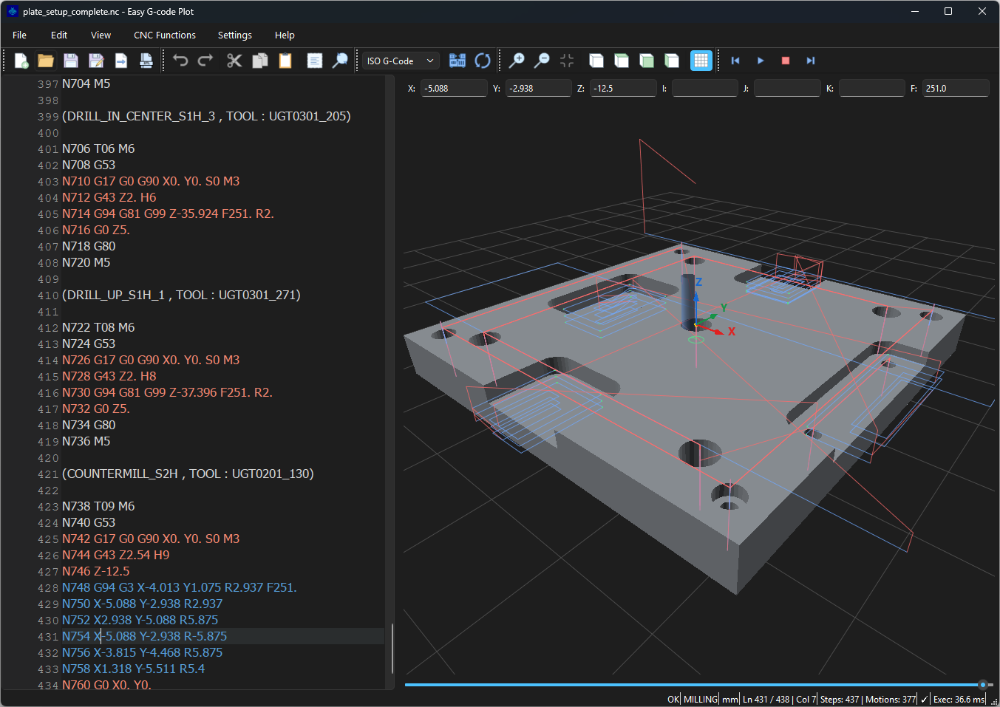

# Easy G-Code Plot

[](https://github.com/MaestroFusion360/easy_gcode_plot/actions/workflows/windows-release.yml)

Download the current standalone Windows executable from [GitHub Releases](https://github.com/MaestroFusion360/easy_gcode_plot/releases). The packaged application does not require a separate Python installation.

<!-- markdownlint-disable MD033 -->

<details>
  <summary><h2>Screenshot</h2></summary>

<p align="center">
  <div style="text-align: center;">
    
  </div>
</p>

</details>

---

- [Easy G-Code Plot](#easy-g-code-plot)
  - [Overview](#overview)
  - [Features](#features)
    - [File Management](#file-management)
    - [Code Editor](#code-editor)
    - [Visualization](#visualization)
    - [Code Manipulation](#code-manipulation)
    - [Export](#export)
    - [Analysis](#analysis)
    - [Tool Configuration](#tool-configuration)
      - [Turning Tools](#turning-tools)
      - [Milling Tools](#milling-tools)
  - [Installation](#installation)
    - [Prerequisites](#prerequisites)
    - [Installation Steps](#installation-steps)
  - [Usage](#usage)
    - [Basic Workflow](#basic-workflow)
    - [Main Interface](#main-interface)
      - [Editor Panel](#editor-panel)
      - [Plot Panel](#plot-panel)
      - [Playback Controls](#playback-controls)
      - [Status Bar](#status-bar)
  - [Supported G-code](#supported-g-code)
    - [Common execution](#common-execution)
    - [FANUC milling](#fanuc-milling)
      - [Milling cutter compensation](#milling-cutter-compensation)
      - [Tool length compensation](#tool-length-compensation)
    - [FANUC turning](#fanuc-turning)
  - [Configuration](#configuration)
    - [Plot](#plot)
    - [Editor](#editor)
    - [Export](#export-1)
    - [Geometry](#geometry)
    - [CNC configuration](#cnc-configuration)
  - [Troubleshooting](#troubleshooting)
    - [Plot Not Displaying](#plot-not-displaying)
    - [Cutter Compensation Not Visible](#cutter-compensation-not-visible)
    - [Machining Time Is UNKNOWN](#machining-time-is-unknown)
    - [Export Errors](#export-errors)
    - [Logging](#logging)
  - [Technical Details](#technical-details)
    - [Architecture](#architecture)
    - [Execution Model](#execution-model)
    - [Arc Geometry](#arc-geometry)
    - [Resource Protection](#resource-protection)
    - [Performance](#performance)
    - [File Support](#file-support)
  - [Development](#development)
    - [Building from Source](#building-from-source)
    - [Code Structure](#code-structure)
    - [Development Rules](#development-rules)
  - [License](#license)

---

## Overview

Easy G-Code Plot is a desktop G-code viewer, editor, analyzer, simulator and trace exporter for FANUC-style turning and milling programs.

The application uses a native Python CNC kernel shared by the GUI and CLI. Source code is parsed and executed once into an authoritative `ExecutionResult` containing the resolved logical motion trace, execution occurrences, modal state, diagnostics and machine signals.

Rendering, playback, statistics and export consume this execution result instead of maintaining independent CNC interpretation paths.

The kernel supports both:

- `fanuc_turn`
- `fanuc_mill`

The project intentionally prefers explicit diagnostics over guessing unsupported CNC semantics.

## Features

### File Management

- New, open, save and save-as
- Drag-and-drop file opening
- Recent Files list
- Missing recent-file cleanup
- Unsaved-changes prompt
- Standard `.nc`, `.cnc` and `.txt` input

### Code Editor

- G-code syntax highlighting
- Configurable font, size and style
- Line numbering and margins
- Caret-line highlighting
- Whitespace and EOL display
- Find and Replace
- Undo / Redo
- Cut / Copy / Paste
- Block renumbering
- Empty-line and whitespace cleanup
- Comment removal

### Visualization

- Interactive 3D toolpath view
- Top, Front and Left orthographic views
- Milling and Lathe modes
- Configurable grid
- Zoom controls
- Step-by-step playback
- Fixed-pixel playback cursor
- Separate rapid and cutting motion rendering
- Shift+Click trajectory picking with source-line synchronization
- Analytical circular interpolation sampled only at the rendering boundary

### Code Manipulation

- Add, remove or renumber N-block numbers
- Remove unnecessary spaces
- Remove empty lines
- Remove comments
- Optional-block skipping
- Source-aware expanded program reconstruction

### Export

The exporter works from the executed logical trace rather than running a second CNC interpreter.

Available modes include:

- Standard trace export
- `EXPANDED TURN PROGRAM`
- `EXPANDED MILL PROGRAM`
- Turning cycle expansion
- Absolute or incremental positioning
- Source unit preservation
- Sequence-number generation
- Forced address output
- Leading-zero suppression
- Configurable headers and footers
- Safety lines
- Address delimiters

Expanded program export follows actual execution-step order, including repeated subprogram execution.

### Analysis

- Toolpath length
- Machining time
- X/Y/Z bounds
- Rapid and feed motion statistics
- Physical turning-radius geometry
- Feed-per-minute and feed-per-revolution execution state
- CSS-aware turning time calculation where sufficient runtime data is available

When machining time cannot be resolved reliably, the application reports it as unknown rather than silently guessing.

### Tool Configuration

Turning and milling tools are configured independently.

#### Turning Tools

Turning tools are identified using FANUC-style tool numbers such as:

```text
T0101
T0202
```

Configured turning tools can provide:

- tool type
- nose radius
- tip orientation
- additional tool metadata

Turning `G41/G42` tool-nose compensation uses the configured tool geometry.

#### Milling Tools

Milling tools use compact tool identities:

```text
T1
T2
...
T99
```

Leading zeroes are not used for milling tool identities.

Configured milling tools can provide:

- tool type
- diameter
- corner radius
- length
- description

Supported milling tool types include:

- flat end mill
- bull-nose mill
- ball end mill
- drill

For supported G17 contours, configured tool diameter is used by cutter-radius compensation.

## Installation

### Prerequisites

- Python 3.11+
- [uv](https://docs.astral.sh/uv/)

### Installation Steps

Clone the repository:

```bash
git clone https://github.com/MaestroFusion360/easy_gcode_plot.git
cd easy_gcode_plot
```

Create or update the project environment:

```bash
uv sync
```

Run the GUI:

```bash
uv run python main.py
```

The same kernel is also available through the CLI:

```bash
uv run python -m app parse program.nc --lang fanuc_turn

uv run python -m app trace program.nc \
  --lang fanuc_turn \
  -o trace.json

uv run python -m app analyze program.nc \
  --lang fanuc_turn

uv run python -m app export program.nc \
  --lang fanuc_turn \
  -o expanded.nc

uv run python -m app export program.nc \
  --lang fanuc_turn \
  --mode program \
  -o expanded-turn.nc

uv run python -m app export program.nc \
  --lang fanuc_mill \
  --mode program \
  -o expanded-mill.nc

uv run python -m app export program.nc \
  --lang fanuc_turn \
  --mode cycles \
  -o expanded-cycles.nc
```

## Usage

### Basic Workflow

1. Open a G-code program through **File → Open** or drag and drop it into the application.
2. Select the appropriate machine mode.
3. Configure machine coordinates, WCS and tools if required.
4. View the resolved toolpath.
5. Edit the source program.
6. Refresh the execution result after changes.
7. Inspect playback, diagnostics and statistics.
8. Export the resolved or expanded program if required.

### Main Interface

#### Editor Panel

The left side contains the source program editor with:

- syntax highlighting
- line numbers
- editing commands
- search and replace

#### Plot Panel

The right side contains the toolpath visualization with:

- 3D view
- Top / Front / Left views
- grid
- zoom
- trajectory picking
- playback cursor

#### Playback Controls

Playback controls allow stepping through the executed logical motion trace.

The current source block and playback position remain synchronized.

#### Status Bar

The status bar displays application and editor state such as:

- character count
- cursor position
- progress for long operations

## Supported G-code

The kernel currently exposes two execution profiles:

```text
fanuc_mill
fanuc_turn
```

Both share the same parsing, Macro B, control-flow, diagnostics and execution-result foundation.

### Common execution

Supported common semantics include:

- `G00/G01/G02/G03` — rapid, linear and circular interpolation
- `G17/G18/G19` — interpolation planes where applicable
- `G20/G21` — inch / metric units
- `G28` — configured primary reference return
- `G54-G59` — work coordinate systems
- `G90/G91` — absolute / incremental programming where applicable
- Macro B expressions and assignments
- `IF/GOTO`
- `WHILE/END`
- `M98/M99` — subprogram execution
- `M00/M01/M02/M03/M04/M05/M08/M09/M30`

Unsupported controller-dependent semantics are diagnosed explicitly rather than inferred heuristically.

### FANUC milling

Milling execution includes:

- XYZ motion
- absolute and incremental positioning
- `G17/G18/G19`
- IJK and R circular interpolation
- helical interpolation
- `G53` machine-coordinate motion
- `G54-G59` work coordinate systems
- `G80/G81/G82/G83/G84/G85/G86` canned cycles
- `G98/G99` canned-cycle return modes
- `G94/G95` feed modes
- M98/M99 subprogram execution
- machine signals
- configured milling tools
- cutter-radius compensation

#### Milling cutter compensation

`G40/G41/G42` cutter-radius compensation uses configured milling tool diameter.

The compensation pipeline follows the executed contour:

```text
entry transition
    ↓
steady compensated motion
    ↓
line / arc corner stitching
    ↓
exit transition
```

Supported geometry includes G17 line, arc and compatible helical paths.

Unsupported compensation cases are preserved as `UNVERIFIED` instead of silently pretending that compensation was successfully applied.

#### Tool length compensation

`G43/G49` state and `H` values are tracked and preserved for execution/export context.

Tool-length H-offset geometry is not currently applied to the motion trace. Explicit `G43` geometry therefore remains reported as unverified where appropriate.

### FANUC turning

Turning execution includes:

- X/Z programming
- U/W incremental axes
- diameter/radius handling
- I/K/R circular interpolation
- `G32/G33` threading motion
- `G70-G76`
- modal `G90/G92/G94` turning cycles
- turning `G83/G84`
- `G96/G97` spindle modes
- `G98/G99` feed modes
- subprogram execution
- machine signals
- tool-nose compensation

`G40/G41/G42` turning compensation uses configured tool nose radius and tip orientation.

## Configuration

The application stores its configuration outside the installation directory.

On Windows:

```text
%LOCALAPPDATA%\easy-gcode-plot\config.ini
```

On first run, a legacy `config.ini` next to the launcher may be migrated to the per-user configuration location.

The configuration stores settings for:

### Plot

- timer speed
- arc calculation mode
- machine coordinates
- lathe mode
- line colors
- background color
- grid color
- grid size
- grid spacing

### Editor

- font
- font size
- font weight
- italic state
- caret-line display
- whitespace display
- EOL display
- margins

### Export

- language
- export mode
- address forcing
- incremental mode
- program start/end strings
- sequence-number settings
- formatting options

### Geometry

- window position
- window size
- maximized state

### CNC configuration

Persistent CNC configuration includes:

- `G54-G59` XYZ work offsets
- `G28` home coordinates
- turning tool definitions
- milling tool definitions

## Troubleshooting

### Plot Not Displaying

Check:

- that the program contains supported motion commands
- that the selected machine mode matches the program
- execution diagnostics
- arc interpretation settings
- machine/WCS configuration
- whether an unsupported position-changing controller command stopped execution

The kernel deliberately stops before some unknown position-changing semantics rather than inventing geometry.

### Cutter Compensation Not Visible

For milling:

- confirm that the program contains `G41` or `G42`
- confirm that the active tool exists in Milling Tools
- use milling tool IDs `T1` through `T99`
- confirm that the tool has a valid positive diameter
- inspect diagnostics for `UNVERIFIED` compensation geometry
- confirm that the contour is supported by the current compensation solver

For turning:

- confirm that the active turning tool exists
- confirm tool nose radius and orientation
- confirm `G41/G42` is active

### Machining Time Is UNKNOWN

This means the runtime could not establish a trustworthy feed rate for one or more motions.

Typical causes include incomplete spindle/feed information during feed-per-revolution execution.

The application intentionally reports unknown time instead of treating an unresolved feed as feed-per-minute.

### Export Errors

Check:

- selected machine profile
- output mode
- unsupported source semantics
- invalid custom header/footer text
- filesystem permissions

### Logging

The application creates:

```text
main.log
```

The log contains runtime, conversion, export and general exception information.

## Technical Details

### Architecture

```text
NC source
   ↓
Lexer / parser
   ↓
AST / evaluated words
   ↓
Macro B + control flow
   ↓
FANUC turning / milling semantic execution
   ↓
resolved runtime modal state
   ↓
analytical geometry
   ↓
ExecutionResult
   ├─ TraceMotion
   ├─ ExecutionStep
   ├─ diagnostics
   ├─ machine signals
   └─ program state
        ↓
        ├─ GUI rendering
        ├─ playback
        ├─ statistics
        ├─ CLI
        └─ export
```

The CNC kernel under `app/gcode/kernel/` has no Qt dependency.

The GUI does not maintain a second CNC execution engine.

### Execution Model

Execution is occurrence-based rather than source-order based.

This is important for:

- subprogram calls
- repeated blocks
- Macro B control flow
- canned-cycle expansion
- machine signals
- expanded program export

Runtime state is attached to execution occurrences rather than reconstructed afterward from source text.

The authoritative result is:

```python
ExecutionResult
```

It contains the resolved motion trace and execution metadata consumed by the rest of the application.

### Arc Geometry

Arc interpretation belongs to the kernel.

The kernel resolves analytical:

- center
- radius
- sweep
- plane
- direction
- full-circle state

Consumers do not attempt alternative IJK interpretations or choose a best-fit center after execution.

Rendering tessellates analytical arcs only when pixels/vertices are required.

### Resource Protection

Execution includes limits for potentially unbounded operations such as:

- Macro B loops
- subprogram calls
- cycle iterations
- generated motions
- executed blocks

Resource-limit failures are returned as structured diagnostics.

### Performance

- Automatic scene refresh is enabled for editor contents up to 5,000 lines
- Larger files can be refreshed explicitly
- Arcs remain analytical until rendering/export sampling
- Statistics operate on the logical trace
- Playback operates on the same trace used by export and analysis

### File Support

Input:

```text
.nc
.cnc
.txt
```

Output:

- G-code text
- expanded turning programs
- expanded milling programs
- trace-oriented exports

Default text encoding:

```text
UTF-8
```

## Development

### Building from Source

Install runtime and development dependencies:

```bash
uv sync
```

Run tests:

```bash
uv run pytest
```

Run Ruff:

```bash
uv run ruff check .
uv run ruff format --check .
```

Or use the project scripts on Windows:

```powershell
scripts\lint.ps1 -Fix
scripts\test.ps1
```

Build the Windows executable:

```powershell
.\scripts\build.ps1
```

Release automation is available through:

```powershell
.\scripts\release.ps1
```

### Code Structure

```text
main.py                              application launcher

app/
├─ __main__.py                       GUI/CLI dispatcher
├─ cli.py                            parse/trace/analyze/export CLI
├─ main_window.py                    PyQt6/QScintilla/PyQtGraph consumer of ExecutionResult
│
├─ gcode/
│  ├─ core.py                        formatting and generic UI-side helpers
│  ├─ exporter.py                    trace-based export; no second CNC execution path
│  ├─ trace_tools.py                 rendering sampling and trace statistics
│  │
│  └─ kernel/
│     ├─ api.py                      public execute() facade and ExecutionResult assembly
│     ├─ api_types.py                public execution/trace/diagnostic data models
│     ├─ ast.py                      parsed CNC AST nodes
│     ├─ model.py                    internal runtime and geometry models
│     ├─ program.py                  parsing helpers, word evaluation and coordinate utilities
│     ├─ lang.py                     Macro B expressions and condition evaluation
│     ├─ execution.py                Macro B flow, subprogram dispatch and execution control
│     ├─ interpreter.py              FANUC turning resolver
│     ├─ milling.py                  FANUC milling resolver
│     ├─ cycles.py                   FANUC turning cycle expansion
│     ├─ geometry.py                 analytical arc resolution in physical geometry
│     ├─ runtime.py                  occurrence-based turning cycle expansion
│     ├─ resources.py                execution budgets, limits and cancellation checks
│     ├─ signals.py                  machine signals and program-end handling
│     ├─ profile.py                  turning contour/profile geometry
│     ├─ tool_compensation.py        turning tool-nose compensation
│     └─ milling_compensation.py     milling G41/G42 cutter-radius compensation
│
├─ ui/                               Qt dialogs, lexer and generated Designer modules
│  ├─ generated/                     pyuic6-generated UI modules
│  └─ ...
│
└─ resources/                        application resources
   └─ icons/                         application and toolbar icons

tests/
├─ fixtures/                         regression CNC programs
├─ test_core.py                      core helpers and execution behavior
├─ test_gui.py                       GUI-to-kernel contract tests
├─ test_interfaces.py                CLI/export/public interface tests
├─ test_macro_b.py                   Macro B and control-flow tests
├─ test_milling.py                   FANUC milling tests
├─ test_stabilization.py             regression and architecture stabilization tests
└─ test_turning.py                   FANUC turning tests

scripts/
├─ build.ps1                         Windows executable build
├─ lint.ps1                          formatting and static-analysis checks
├─ release.ps1                       release/version/tag automation
└─ test.ps1                          project test runner
```

### Development Rules

CNC semantics belong in the kernel.

Rendering code must not independently reinterpret CNC commands.

In particular:

- source is executed once
- consumers use `ExecutionResult`
- arc semantics are resolved in the kernel
- rendering may sample geometry but must not redefine it
- statistics derive from executed physical geometry and runtime state
- export must preserve execution order
- unsupported semantics must be diagnosed rather than guessed
- resource protection must remain active for loops, cycles and subprogram execution

To regenerate Python code from an edited Qt Designer `.ui` file:

```bash
uv run pyuic6 app/ui/generated/export.ui -o app/ui/generated/export.py
```

> Note: PyQt6 wheels no longer bundle `pyrcc6`. `app/resources/files_res.py` is
> committed pre-generated; edit it only together with `files_res.qrc`.

## License

MIT License — see [LICENSE](License.md).

---

<p align="center">
  
</p>
