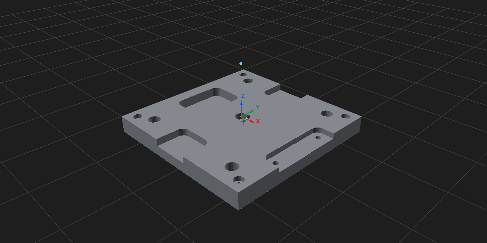
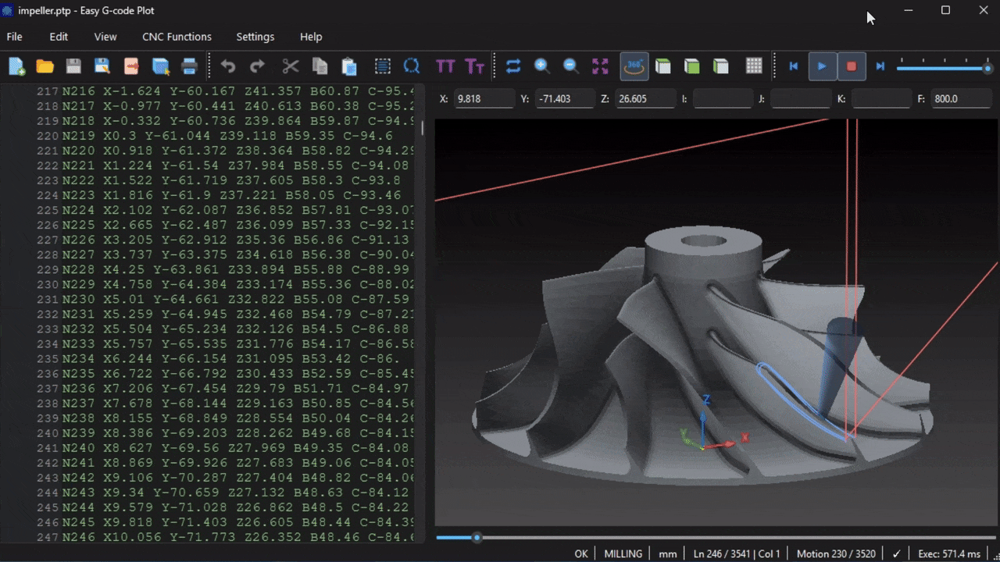
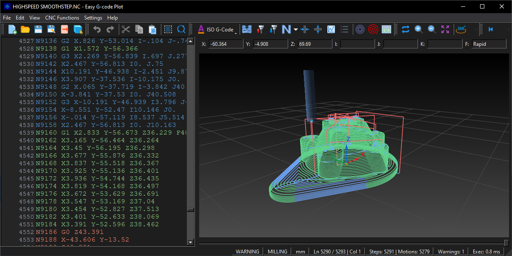
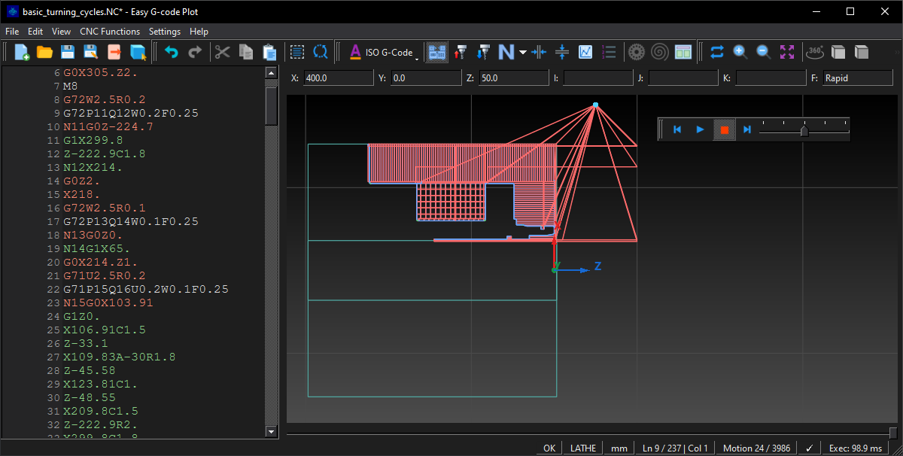
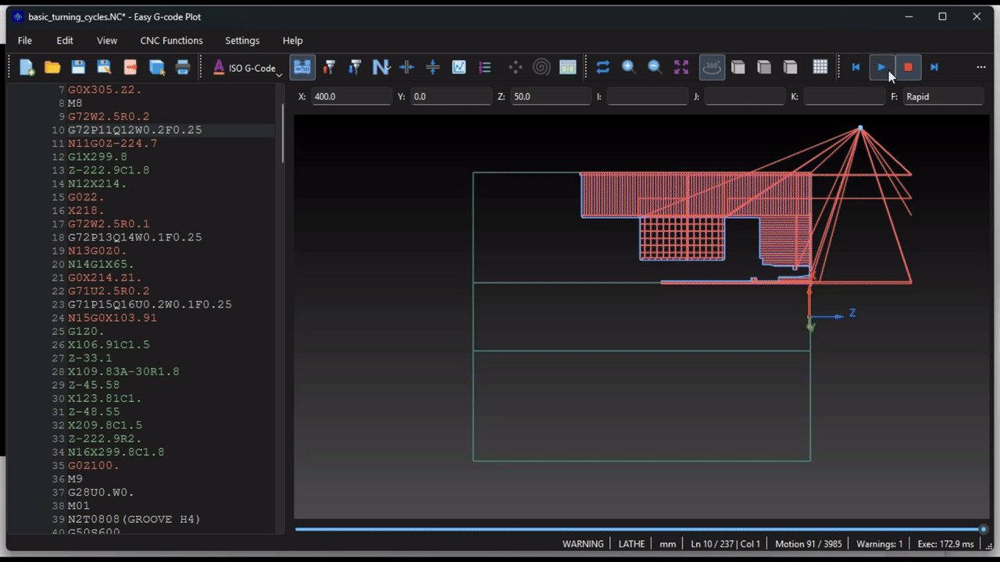
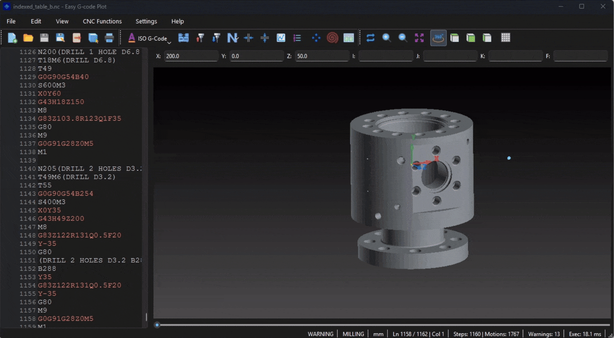

# Easy G-Code Plot

Desktop G-code editor, analyzer, backplotter and trace exporter for FANUC-style turning and milling, with native SINUMERIK 840D milling support.

[](https://github.com/MaestroFusion360/easy_gcode_plot/actions/workflows/release.yml)

**Project site:** [English](docs/index.html) · [Русский](docs/ru/index.html)
See [docs/PUBLISHING.md](docs/PUBLISHING.md) for local preview and GitHub Pages setup.

<!-- markdownlint-disable MD033 -->

<p align="center">
  
</p>

<details>
  <summary><strong>More screenshots</strong></summary>

  <p align="center">
    
  </p>

  <p align="center">
    
  </p>

  <p align="center">
    
  </p>

  <p align="center">
    
  </p>

  <p align="center">
    
  </p>
</details>

---

## What it is

Easy G-Code Plot models supported CNC program semantics and toolpath geometry. It is not a complete physical CNC-machine simulator.

The GUI, playback, statistics, stock-removal tools, CLI analysis and exporters all consume the same authoritative execution result produced by the shared CNC kernel:

```text
G-code source
    |
    +--> Tool discovery (preliminary scan)
    |      |- native Cython scanner
    |      `- Python fallback
    |
    `--> Parser / controller frontend
           |- native Cython parser
           `- per-block Python fallback where required
                |
                v
             Program / AST
                |
                v
          CNC execution kernel
          (flow, cycles, compensation, geometry)
                |
                v
           ExecutionResult
                |
                +--> GUI rendering / playback
                +--> statistics
                +--> batch / CLI trace
                `--> NC / DXF export
```

Tool discovery is a separate preliminary source scan; the parser constructs Program/AST and the kernel owns execution semantics. Rendering, statistics and export consume ExecutionResult rather than interpreting G-code independently. Python fallback is supported in source checkouts, including individual complex blocks. Packaged releases require all three native extensions; missing extensions are explicit runtime errors.

Unsupported or ambiguous controller behavior is reported explicitly instead of being converted into guessed geometry.

## Highlights

### FANUC-style turning

- Macro B expressions, conditions and loops, with bitwise AND/OR/XOR and LN/EXP.
- `G65` custom-macro calls and `M98/M99` subprograms.
- Turning cycles `G70`–`G76`.
- `G32`, `G33` and `G92` threading.
- Tool-nose compensation.
- Direct A/C/corner-R programming.
- Cutter-aware Stock Removal, including thread profiles.

### FANUC-style milling

- Canned cycles and helical arcs.
- `G15/G16` polar-coordinate programming.
- Cutter-radius compensation.
- `G10`, `G50`, `G51`, `G52`, `G54.1`, `G68` and `G69` coordinate operations.
- Indexed 3+2 milling with `G68.2/G53.1`.
- Continuous five-axis TCP motion with `G43.4` on supported angled AC/BC table profiles.
- Indexed A/B milling and planar X/C contour mapping with selected rotary profiles.
- Fixture coverage for `4ax_table_a`, `4ax_table_b` and `4ax_table_c`.
- Tapered ball-mill preview (`TAPER_BALL_MILL`).

### SINUMERIK 840D

- Native three-axis milling for `.mpf` / `.spf`.
- Native `G0/G1/G2/G3`, `CR=`, work offsets, compensation and common tool/spindle/coolant commands.
- `G290/G291` native / ISO Dialect M switching.
- Modal `MCALL CYCLE81/82/83/84`.
- Native R parameters for the supported numeric subset.
- GUI/CLI/kernel TRAORI/TRAFOOF TCP on the angled AC/BC table profiles, including G2/G3 with rotary interpolation.
- Native CYCLE800 static frames and TRAORI/TRAFOOF TCP on angled AC/BC tables. Numeric A/B/C, direct R references and incremental IC values are supported for configured axes; DC selects the shortest absolute rotary approach; ambiguous half turns remain rejected.
- `TURN=` multi-revolution arc handling.
- Resolved conversion between supported FANUC, SINUMERIK ISO-M and SINUMERIK native milling geometry.

See [SINUMERIK 840D](#sinumerik-840d) for the exact supported subset and current limitations.

### GUI and visualization

- G-code editor with syntax highlighting, line numbers, search, replace and cleanup tools.
- Interactive OpenGL toolpath.
- Logical-motion playback with source-line synchronization.
- Toolpath statistics: HTML summary, per-tool selector, metric/imperial display and Export HTML. Exported reports include a static SVG projection (XY milling, XZ turning) below the table. SVG uses Print page fitting and line styles, retaining every motion. CLI: `python -m app analyze program.nc --html statistics.html`.
- HTML exports always use a light theme; the Statistics dialog follows the application theme. GUI report/program exports display their completion status. Playback highlights the current logical motion, including a whole arc, using the configured current-move color.
- CNC editing assistants for hole patterns, pockets and reusable snippets.
- ASCII and binary STL overlays with solid and feature-edge modes.
- STL positioning, transforms, arrays, sections and statistics.
- SQLite-backed turning and milling tool libraries.
- English and Russian UI.
- Light and Dark themes.
- UTF-8 and Windows-1251 input.

### Export and automation

- Full Program export.
- Expanded Execution export.
- Plot Data export.
- DXF export.
- CLI `parse`, `trace`, `analyze`, `report`, `batch`, `export` and `batch-export`.
- JSON and CSV batch reports.
- Native Cython acceleration with compatible Python fallback.

Detailed controller behavior, limits, configuration and troubleshooting are documented in [FAQ.md](FAQ.md), also available through **Help → FAQ**.

---

## Controller support overview

| Area | FANUC-style | SINUMERIK 840D native |
| --- | --- | --- |
| Turning | Yes | No |
| Three-axis milling | Yes | Yes |
| Macro / variable subset | Macro B | R parameters |
| Drilling / tapping cycles | Yes | `MCALL CYCLE81/82/83/84` |
| Indexed rotary milling | Yes | Angled AC/BC GUI/CLI/kernel numeric subset |
| Continuous TCP | `G43.4`, including rotary arcs | GUI/CLI/kernel `TRAORI` / `TRAFOOF`, angled AC/BC subset |
| Tilted working plane | `G68.2/G53.1` | `CYCLE800` axis-by-axis subset (GUI/CLI/kernel) |
| Native controller conversion | FANUC / ISO-M | Resolved native output |
| Batch analysis | Yes | Yes |

`CLEAN` CLI status means that the supported execution model produced no diagnostics. It is not machine validation.

---

## SINUMERIK 840D

### Input modes

Every `.mpf` / `.spf` file is treated as a SINUMERIK container.

- Native mode is the default.
- Standalone `G290` selects native Siemens syntax.
- Standalone `G291` selects ISO Dialect M.
- CLI commands still use `--lang fanuc_mill` for the common milling geometry model.

MPF/SPF documents retain the selected rotary-kinematics profile. Settings and Options expose the enabled profiles; native CYCLE800/TRAORI require a supported angled AC/BC table. The kernel rejects incompatible axes, profiles and ISO-M rotary commands.

### Native subset

Native support currently includes:

- `G0/G1/G2/G3`
- `CR=`
- plane selection
- absolute / incremental positioning
- metric `G710`
- work offsets
- `G40/G41/G42`
- `D0/D1`
- tool, spindle and coolant commands
- machine-coordinate `G0 SUPA`
- `MSG`
- `WORKPIECE`
- `G64`
- semicolon comments

`MSG`, `WORKPIECE`, `G64` and comments do not generate phantom geometry.

CYCLE800 uses Siemens bit-coded axis order, not FANUC Euler ZXZ. Modes 57/54/39/27/30/45, ST200000 (new)/200001 (additive), DIR-1/0/1, quoted TISCH/empty data-set names and numeric/direct R arguments are supported on angled AC/BC tables. DIR selects the principal first-table-joint branch; 0 calculates the frame without indexing. Reset uses `CYCLE800()`, bare `CYCLE800`, or a zero frame with TC="0" (ST200000 or compatibility ST110000). FR0/1/2 are accepted as logical retract requests: OEM machine retract paths are not simulated. FR_I must be empty/zero; DMODE0/1 is supported. Other options and arbitrary OEM data sets reject.

### R parameters

The supported native subset accepts numeric assignments such as:

```text
R1=500
R2=6000
```

and references in supported addresses and cycles, including:

```text
F=R1
S=R2
X=R1
CR=R1
TURN=R1
```

R state is separate from FANUC `#` variables and resets for each execution.

Undefined references, arithmetic/control flow, arrays and Siemens system variables are outside the current subset.

### MCALL cycles

Modal `MCALL CYCLE81/82/83/84` expands supported numeric parameters into resolved motions. Bare `MCALL` cancels the active cycle.

`CYCLE84` implements the supported CAM-oriented single-pass metric right-hand tapping subset. It models trajectory and logical spindle signals, not spindle-angle simulation.

See [FAQ.md](FAQ.md#sinumerik-840d-input) and [FAQ_RU.md](FAQ_RU.md#sinumerik-840d) for exact parameter constraints.

### TURN=

`TURN=n` supports integer values from `0` to `999` for supported `G2/G3` arcs using IJK or `CR=`.

The kernel keeps a single resolved arc with the complete sweep. Rendering, playback and statistics preserve all revolutions. DXF uses sampled polylines when required.

### Current kinematic limit

Native XYZ geometry and modal cycles are supported; the GUI/CLI/kernel also accepts the bounded TCP subset below.

GUI/CLI/kernel TRAORI/TRAFOOF supports TCP on the angled AC/BC table profiles, including Cartesian G2/G3 arcs with rotary interpolation. Numeric A/B/C assignments and direct R references are supported only for configured axes. CYCLE800 supports the bounded static-frame subset described above. IC(numeric/direct R) is incremental independently of G90/G91; CUT3DC and FL[] remain explicitly unsupported. GUI profile selection reaches the same kernel and plotting path.

### Native acceleration

Contiguous literal position blocks can use the Cython execution path. The Python capability gate runs before state changes.

Native declarations, `G290/G291` switches and controller operations break an accelerated run; later eligible blocks can resume acceleration. Blocks under active native cycles stay on the Python reference path until the cycle is cancelled.

---

## Export model

Exporters consume the resolved kernel result instead of interpreting G-code independently.

This is intentional: controller execution is resolved once, then downstream consumers serialize or visualize the same geometry.

### Resolved conversion

Resolved Program Conversion supports:

- `fanuc_mill`
- `sinumerik_iso`
- `sinumerik_native`

for supported three-axis milling input.

Example:

```powershell
.\easy_gcode_plot_cli.exe export fanuc_part.nc --lang fanuc_mill --mode resolved --target-dialect sinumerik_native -o native_part.mpf

.\easy_gcode_plot_cli.exe export native_part.mpf --lang fanuc_mill --mode resolved --target-dialect fanuc_mill -o resolved_part.nc
```

Cycles and variables are evaluated before serialization. Resolved output is written in a zero-offset frame.

SINUMERIK native output uses explicit I=AC/J=AC/K=AC absolute centers and can preserve `TURN=`.

### Full Program conversion

Native SINUMERIK source can also be formatted without dialect conversion: use Milling Full Program with **As source** or **SINUMERIK native** in the GUI, or `--mode full --target-dialect sinumerik_native` in the CLI. This preserves expressions, native calls, modal commands, CYCLE800 and TRAORI, while applying numbering, address spacing, leading zeros and comment inclusion. Native comments retain semicolon syntax. XYZ/rotary geometry is not rebuilt.

```powershell
.\easy_gcode_plot_cli.exe export native_part.mpf --lang fanuc_mill --mode full --target-dialect sinumerik_native --sequence-numbers -o formatted.mpf
```

Source-preserving `--mode full` supports verified FANUC ↔ SINUMERIK ISO-M conversion and bounded native SINUMERIK → FANUC normalization.

SINUMERIK native → FANUC milling `--mode full` uses validated kernel normalization before FANUC emission and target re-execution. Supported units (`G70/G71/G700/G710`), inverse-time feed (`G93`), evaluated parameters and radius arcs retain their executed semantics. Safe metadata warnings remain in source diagnostics without blocking conversion. Unrepresentable native cycles, frames, orientation, diameter modes and rotary/TCP semantics still block export. FANUC → native Full Program remains unavailable; FANUC → ISO-M (`G291`) is unchanged.

```powershell
.\easy_gcode_plot_cli.exe export native_part.mpf --lang fanuc_mill --mode full -o fanuc_part.nc
```

Programs containing unsupported rotary/TCP/tilted-plane semantics are rejected before NC output is written. The exporter does not invent `TRAORI`, `TRAFOOF`, `CYCLE800` or controller-switching sequences.

### GUI export

The GUI provides the verified SINUMERIK 840D ISO-M (`G291`) target.

Native SINUMERIK resolved conversion is currently a CLI capability.

---

## Quick start

### Windows release

Download the GUI executable and `easy_gcode_plot_cli.exe` from [GitHub Releases](https://github.com/MaestroFusion360/easy_gcode_plot/releases/latest).

Python and Visual Studio are not required for packaged applications.

```powershell
.\easy_gcode_plot_cli.exe --help
.\easy_gcode_plot_cli.exe analyze program.nc --lang fanuc_turn
.\easy_gcode_plot_cli.exe batch C:\Programs --lang fanuc_mill -o C:\Reports
```

### Linux release

Download the Linux x64 archive and matching `.sha256` file.

```bash
sha256sum -c Easy-G-Code-Plot-*-Linux-x64.tar.gz.sha256
tar -xzf Easy-G-Code-Plot-*-Linux-x64.tar.gz

./easy_gcode_plot
./easy_gcode_plot_cli --help
```

### Run from source

Requirements:

- Python 3.13+
- [uv](https://docs.astral.sh/uv/)
- C compiler:
  - Visual Studio Build Tools with **Desktop development with C++** on Windows
  - platform compiler and Python development headers on Linux

```bash
git clone https://github.com/MaestroFusion360/easy_gcode_plot.git
cd easy_gcode_plot

uv sync --no-dev
uv run --no-dev python main.py
```

`uv sync` builds the tracked Cython `.pyx` sources. Generated `.c`, `.pyd` and `.so` files are not stored in Git.

If native extensions cannot be loaded, the application remains functional through the slower Python fallback.

---

## GUI workflow

1. Open or drag a `.nc`, `.cnc`, `.ptp`, `.mpf`, `.spf` or `.txt` program into the application.
2. Enable **Lathe Mode** for turning, or leave it disabled for milling.
3. Configure WCS, machine home and tools when required.
4. For indexed FANUC milling, select the matching **Settings → Rotary kinematics** profile.
5. Refresh and inspect the resolved toolpath.
6. Use playback, Tokens/Macro Variables and Statistics to inspect execution.
7. Optionally import an STL reference model.
8. Export the required program or trajectory representation.

**File → Print** (`Ctrl+P`) produces a page-fitted vector drawing in the current camera orientation.

---

## CNC editing assistants

The **CNC Functions** menu and toolbar provide:

- **Hole Calculator** — circular or serpentine rectangular hole patterns with live XY preview.
- **Pocket Calculator** — circular or rectangular milling fragments with multiple depths, stock, conventional/spiral clearing, helical entry and optional finish pass.
- **Snippets** — reusable persistent G-code fragments stored in the per-user SQLite database.

Hole and Pocket calculators are milling-only assistants.

The calculators insert code into the editor; they do not execute or export it automatically. Refresh the toolpath after reviewing the generated block.

---

## STL overlays

ASCII and binary STL models can be used as visual references.

The **Settings → STL Objects** panel supports:

- independent undo/redo
- base-point and bounding-box picking
- positioning and transforms
- circular and rectangular arrays
- 3D sections
- copyable statistics
- millimetre / inch display

Solid STL mode can hide toolpath segments that are behind the model surface.

---

## Tool Library

**Settings → Tool Library** manages separate milling and turning tool sets.

- **Current Program** contains temporary T-slot assignments discovered or configured for the open program.
- **Saved Library** contains persistent tools stored in the per-user `tools.db`.

Literal T selections, comments and operation context can infer tool descriptions and geometry. Program discovery never modifies the saved library automatically.

The turning library supports:

- Diamond 80
- Diamond 35
- Square
- Round
- Triangle
- Groove
- Thread
- Drill
- Tap

OD, ID and Face are separate application flags.

JSON and CSV export write the complete working library for the active machine type.

---

## CLI

The CLI uses the same CNC kernel as the GUI.

### Common commands

```powershell
.\easy_gcode_plot_cli.exe parse program.nc --lang fanuc_turn

.\easy_gcode_plot_cli.exe trace program.nc --lang fanuc_turn -o trace.json

.\easy_gcode_plot_cli.exe analyze program.nc --lang fanuc_turn

.\easy_gcode_plot_cli.exe batch .\programs --lang fanuc_mill -o batch-report

.\easy_gcode_plot_cli.exe export program.nc --lang fanuc_turn -o expanded.nc

.\easy_gcode_plot_cli.exe batch-export .\programs --lang fanuc_mill --mode expanded -o normalized
```

Indexed example:

```powershell
.\easy_gcode_plot_cli.exe analyze indexed.nc --lang fanuc_mill --kinematics 4ax_table_b
```

SINUMERIK examples:

```powershell
.\easy_gcode_plot_cli.exe analyze part.mpf --lang fanuc_mill

.\easy_gcode_plot_cli.exe export part.mpf --lang fanuc_mill --mode resolved --target-dialect fanuc_mill -o part.nc

.\easy_gcode_plot_cli.exe export fanuc_part.nc --lang fanuc_mill --mode resolved --target-dialect sinumerik_native -o part.mpf
```

### Batch analysis

`batch` scans recursively by default.

Without `--lang`, each `.mpf/.spf` file selects milling SINUMERIK; other files keep the turning default. An explicit `--lang` applies to all files.

Use the shared single-file statistics/HTML API for every program:

```powershell
.\easy_gcode_plot_cli.exe batch .\programs --html .\reports\html -o .\reports
```

This writes one HTML report with a tool selector and XY/XZ SVG per input, alongside the JSON/CSV summary. Relative directories and complete input names are preserved (`sub/part.mpf` → `html/sub/part.mpf.html`). Add `--inches` for imperial display. Each source is executed once; failed/partial execution still produces its statistics report. An unreadable input has diagnostics in JSON/CSV. HTML write errors are reported per file without stopping the batch.

Default recognized extensions:

```text
.nc .cnc .ptp .mpf .spf .tap .txt
```

FANUC programs without a conventional NC extension can also be discovered from their first blocks when default discovery is used.

Reports:

```text
batch_report.json
batch_report.csv
```

Per-file status:

- `CLEAN`
- `WARNINGS`
- `ERRORS`

An empty scan produces `NO_FILES`.

Reports include diagnostics, motion/executed-block counts and unknown or unsupported G/M codes.

Use:

```text
--extensions .nc,.mpf
```

to restrict file types, or:

```text
--top-level-only
```

to disable recursive scanning.

### Batch export

`batch-export` writes a mirrored output tree plus:

```text
batch_export_report.json
batch_export_report.csv
```

Source files are never modified.

Files with invalid or incomplete execution are skipped while the remaining inputs continue.

For mixed indexed batches, `--kinematics-map` can assign a profile per relative input path.

### Preset scripts

Windows:

```powershell
.\scripts\ps1\batch\batch_mill.ps1
.\scripts\ps1\batch\batch_turn.ps1
.\scripts\ps1\batch\batch_export_mill.ps1
.\scripts\ps1\batch\batch_export_turn.ps1
```

Linux:

```bash
bash scripts/sh/batch/batch_mill.sh
bash scripts/sh/batch/batch_turn.sh
bash scripts/sh/batch/batch_export_mill.sh
bash scripts/sh/batch/batch_export_turn.sh
```

Run:

```powershell
.\easy_gcode_plot_cli.exe --help
```

or:

```powershell
.\easy_gcode_plot_cli.exe batch --help
```

for the complete command-line reference.

---

## Settings

The main execution settings are under **Settings → Options**.

### General

- Language
- Theme
- Auto Update
- Auto update max segments
- Maximum generated motions
- Toolbar icon size

### CNC / Execution

- Autodetect Arc Type
- Ignore Block Skip
- G41/G42 correction
- Arc tolerance
- Arc sampling preset
- Maximum / minimum circular radius
- Minimum chord length

Sampling controls affect GUI trace representation without changing the resolved CNC execution geometry.

Explicit Refresh operations are cancellable.

---

## Development

Install development dependencies and run the standard checks:

```bash
uv sync --group dev

uv run pytest
uv run ruff check .
uv run ruff format --check .
```

Build helpers are available for both platforms:

| Task | Windows PowerShell | Linux shell |
| --- | --- | --- |
| Tests | `.\scripts\ps1\test.ps1` | `bash scripts/sh/test.sh` |
| Lint | `.\scripts\ps1\lint.ps1` | `bash scripts/sh/lint.sh` |
| Native extensions | `.\scripts\ps1\build-native.ps1` | `bash scripts/sh/build-native.sh` |
| PyInstaller package | `.\scripts\ps1\build.ps1` | `bash scripts/sh/build.sh` |

Linux CLI build:

```bash
bash scripts/sh/build.sh --console --skip-tests
./dist/easy_gcode_plot_cli --help
```

Native and release builds use the separate `.venv-build` environment and rebuild when tracked Cython sources change.

The CNC kernel lives under:

```text
app/gcode/kernel/
```

Exporters consume the kernel's authoritative execution result instead of interpreting G-code again.

New CNC semantics belong in the kernel and should be covered by deterministic regression tests.

See [FAQ.md](FAQ.md#development) for package structure, Qt generation, detailed settings and release notes.

---

## License

MIT License — see [LICENSE.md](LICENSE.md).

---

<p align="center">
  
</p>
